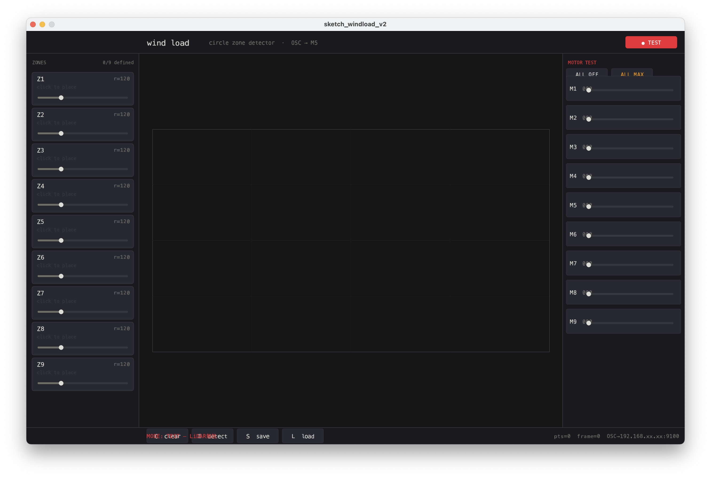
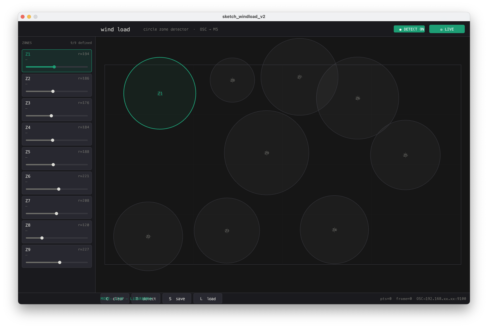

# wind load — LiDAR zone detector & motor controller

Hokuyoの点群データをTouch Designer経由でOSC受信し、9つの円形ゾーンへの人物検出をリアルタイムで行うProcessingスケッチ。検出結果をOSCでM5Stackに送信し、PCA9685+MX1508経由でDCモーター×9台を制御する。

## 機能
- LIVE / TEST モード切替
- 円形ゾーン×9のGUI定義（クリックで中心配置、スライダーで半径調整）
- ゾーン入場検知（エッジ検出）→ `/motor/1`〜`/motor/9` でPWM値をOSC送信
- TESTモード：各モーターのPWMをスライダーで手動制御
- ゾーン設定のJSON保存/読み込み
- DBSCANクラスタリングによる人物位置推定

## 依存
- oscP5
- netP5
